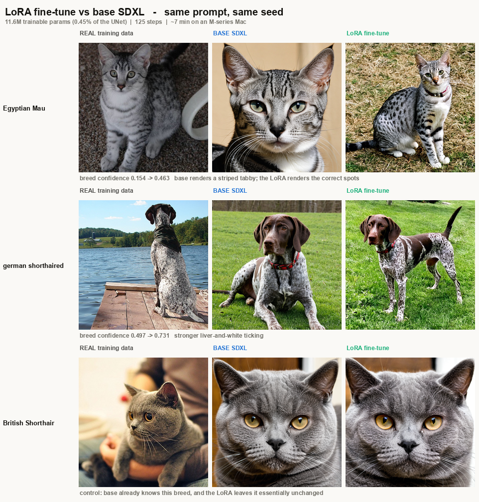

# Pet-breed LoRA for SDXL — a proof of concept

**Claim under test:** can a *tiny* LoRA adapter teach a large pretrained diffusion
model breed knowledge it does not already have — without degrading the image
quality, prompt-following, or general knowledge that make the base model useful?

**Result: yes, and cheaply.** 11.6M trainable parameters (0.45% of SDXL's UNet),
125 optimisation steps, about **7 minutes** on an Apple M-series laptop.



Measured across all 37 breeds, base model vs fine-tune, same prompts and seeds:

| metric | base SDXL | + LoRA |
|---|---|---|
| mean breed confidence (37 breeds) | 0.4424 | **0.4904** (+10.9%) |
| breeds improved | — | **25 / 37** |
| breed accuracy (held-out eval set) | 11/12 | **12/12** |
| prompt adherence (CLIP-T) | 0.3341 | **0.3386** |
| sample diversity | 0.0306 | **0.0690** |

Largest gains land exactly where they should — on breeds the base model renders
incorrectly:

| breed | base | LoRA | Δ |
|---|---|---|---|
| Egyptian Mau | 0.154 | 0.463 | **+0.309** |
| german shorthaired | 0.497 | 0.731 | +0.234 |
| Russian Blue | 0.326 | 0.543 | +0.216 |
| Abyssinian | 0.402 | 0.602 | +0.200 |

Egyptian Mau is the clearest case: it is the only naturally **spotted** domestic
cat, and base SDXL draws a striped tabby instead. The fine-tune fixes it.

Breeds the base model already knows (British Shorthair, Maine Coon, Persian) are
left essentially unchanged, and breeds that were never in the training data
(labrador, australian shepherd) are unharmed — no catastrophic forgetting.

---

## Quick start

Five commands, from an empty checkout to generated images.

### 1. Download the dataset

```bash
poetry run prepare-data
```

Downloads Oxford-IIIT Pet (~792 MB, **no credentials required**), extracts it,
drops unreadable/too-small files, and writes one caption per image. Idempotent —
re-running skips work already done.

Result: `data` — 6,603 images across 37 breeds (12 cat, 25 dog),
each with a `.txt` caption.

### 2. Install dependencies

```bash
poetry install
```

> On an NVIDIA machine, install the CUDA build of torch afterwards:
> `poetry run pip install --force-reinstall torch --index-url https://download.pytorch.org/whl/cu121`

### 3. Train

The judge first — a supervised breed classifier used for checkpoint selection
(see [Why not the loss?](#why-not-the-loss)):

```bash
poetry run breed-probe fit --probe-path runs/breed_probe.npz
# -> held-out accuracy ~0.91 across 37 breeds
```

Then the LoRA:

```bash
poetry run train-lora \
  --data-dir data/lora_pets37_styled \
  --output-dir runs/v1 \
  --base-model SG161222/RealVisXL_V4.0 --variant fp16 \
  --resolution 512 --rank 8 --lora-alpha 8 \
  --learning-rate 5e-5 --gradient-accumulation-steps 2 \
  --max-train-steps 1000 --gradient-checkpointing \
  --eval-every 125 --early-stop-patience 5 \
  --probe-path runs/breed_probe.npz
```

Roughly **1 hour**, and it stops itself once the breed score plateaus. The best
adapter is written to `runs/v1/best/` — *not* the final one, which matters (see below).

Watch it: `tensorboard --logdir runs/v1/logs`

### 4. Inference — base vs fine-tune

```bash
poetry run infer \
  --lora-path runs/v1/best \
  --base-model SG161222/RealVisXL_V4.0 \
  --prompt "a photo of an egyptian mau cat" \
  --compare-base --num-images 2
```

Writes two folders with **matching filenames**, so the same prompt and seed sit at
the same name in each:

```
outputs/compare/base_model/     <- adapter muted (scale 0.0)
outputs/compare/lora_model/     <- adapter active
```

### 5. Inference with your own prompt

Any prompt works — the adapter does not constrain you to the training captions:

```bash
poetry run infer --lora-path runs/v1/best \
  --prompt "RAW photo of a havanese dog sitting on a snowy mountain peak, tongue out, 85mm lens" \
  --compare-base --steps 35 --seed 777

# several prompts in one run, separated by "|"
poetry run infer --lora-path runs/v1/best \
  --prompt "a photo of a beagle dog|a photo of a bombay cat" --compare-base

# sweep adapter strength; scale 0 is the base model, so the sweep has its own control
poetry run infer --lora-path runs/v1/best \
  --prompt "a photo of a beagle dog" --lora-scales 0,0.3,0.5,0.7,1
```

---

## Evaluation

Score checkpoints against the base model on four axes:

```bash
poetry run eval-lora \
  --checkpoints base,runs/v1/best \
  --breeds Egyptian_Mau,Birman,Bombay,Siamese,Persian,beagle
```

Build the full 37-breed comparison sheets (2 breeds per file → 19 files):

```bash
poetry run infer --lora-path runs/v1/best --compare-base --prompt "<all 37 prompts, | separated>"
poetry run build-sheets --compare-dir outputs/compare --out-dir outputs/sheets
```

Pre-built results live in [`artifacts`](defusion_model/artifacts/comparisons/):

| file | contents |
|---|---|
| `README_hero.png` | the three-breed summary above |
| `ALL_side_by_side_{1,2,3}of3.png` | all 37 breeds, compact `real / base / LoRA` |
| `01_…png` – `19_…png` | per-breed-pair sheets, larger tiles, 2 real photos each |
| `havanese_snow/` | out-of-distribution scene test |
| `labrador_tricolor/` | untrained-breed + attribute-transfer test |

---

## What we learned

### Why not the loss?

Diffusion training loss **cannot** select a checkpoint. Each step samples a random
timestep, and loss varies by an order of magnitude across timesteps, so the value
mostly reports *which timestep was drawn*. Over 1,500 steps our loss trend was
`r = -0.019` — statistically indistinguishable from flat.

Worse, it points the wrong way. In one run the loss at step 750 was 0.0054 (near
its lowest) while the actual breed metric had dropped 23%, and images at step 1500
showed visible colour casts and anatomical drift.

So checkpoints are selected by generating a fixed prompt/seed grid at each
evaluation and scoring it with a **supervised judge** — a linear probe on CLIP
features trained on the labelled dataset, with a known held-out accuracy of 0.91.
Knowing the judge's error rate matters: it is only 0.78 accurate on Egyptian Mau,
so a weak score there is partly judge error, not model failure.

The selection rule: **take the last checkpoint before prompt adherence or diversity
starts to fall.** Breed accuracy keeps rising as an adapter overfits, so it cannot
be maximised on its own — the decline of the *other* metrics is the stop signal.

### Captions decide what gets learned

Every image here is an amateur snapshot. With captions like
`"a photo of a <breed> dog"`, the only varying token is the breed, so **the style
binds to the shared phrase** — gradient descent learns the constant signal before
the varying one. The model then applies snapshot framing to every one of those breeds.

Giving the style its own token fixes it:

```
training:   "a snapshot photo of a beagle dog"
inference:  "a photo of a beagle dog"           <- style token omitted
```

| | plain captions | + style token |
|---|---|---|
| rank / lr | 16 / 1e-4 | 8 / 5e-5 |
| peak breed score | 0.3320 | **0.4189** |
| steps to peak | 1000 | **125** |

**+26% on the metric in 1/8 the training.**

### Adaptation happens fast, then decays

Measured across three runs, the score peaks around step 125 and declines
monotonically after:

```
step 125:  0.4189   <- peak, saved to best/
step 250:  0.3637
step 375:  0.3584
step 500:  0.3362
step 625:  0.3326
step 750:  0.2898   <- early stopping fires
```

Long training was actively counterproductive. This is why `best/` — not the final
weights — is the artefact to ship.

---

## Repository layout

```
prepare_data.py            step 1: download + caption the dataset
breed_probe.py             the supervised judge (fit / score)
eval_lora.py               4-metric checkpoint ranking
build_all_sheets.py        comparison sheets, 2 breeds per file
sdxl_lora/
  dataset.py               image+caption dataset with SDXL micro-conditioning
  train_lora.py            training loop, probe-based early stopping
  inference.py             base vs LoRA, two folders, strength sweep
artifacts/comparisons/     pre-built result images
```

A separate from-scratch DDPM (`train.py`, `sample.py`, `diffusion`) also lives
here from earlier experiments — it is unrelated to the LoRA pipeline.

## Implementation notes

Details that are easy to get wrong and expensive to debug:

- **fp16 breaks the SDXL VAE.** The stock VAE overflows and yields black images or
  NaN loss. Under `--mixed-precision fp16` the scripts substitute
  `madebyollin/sdxl-vae-fp16-fix` automatically. Prefer `bf16` where supported.
- **LoRA parameters stay fp32** even under mixed precision — fp16 master weights
  underflow at these learning rates and the adapter silently stops learning.
- **SDXL micro-conditioning is real input.** The dataset reports each image's true
  original size and crop offset (mirroring the offset on horizontal flip). Feeding
  constants there produces soft, off-centre output. This dataset's median short
  edge is 358 px, well under SDXL's native 1024, and the size conditioning is what
  lets the model treat those as low-resolution examples rather than as blur to imitate.
- **Checkpoints save the adapter only.** `accelerator.save_state()` serialises the
  whole frozen 2.6B UNet — 9.9 GB per checkpoint to preserve an 89 MB adapter. It is
  behind `--save-full-state` and off by default.
- **More sampling steps can look worse.** With `clip_denoised` active on an
  under-trained model, each step re-projects the x₀ estimate into range and pulls
  slightly toward the mean; image std fell from 0.352 at 25 steps to 0.197 at 200.

## Hardware

Developed on an Apple M-series laptop (32 GB, MPS), ~3.1 s/step at 512 px with
gradient checkpointing. VRAM at 1024 px, batch 1, rank 16, bf16: ~19 GB baseline,
~12 GB with `--gradient-checkpointing`, ~10 GB adding xformers (CUDA only).

## Licence / attribution

Dataset: [Oxford-IIIT Pet](https://www.robots.ox.ac.uk/~vgg/data/pets/) (Parkhi et al., 2012).
Base model: [RealVisXL V4.0](https://huggingface.co/SG161222/RealVisXL_V4.0), an SDXL fine-tune.
Judge: CLIP ViT-B/32.
