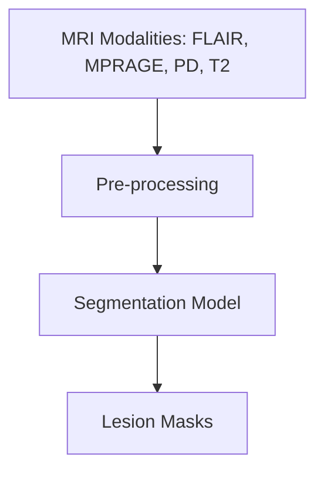

# Multiple Sclerosis (MS) Lesion Segmentation

Automated segmentation of MS lesions from multi-modal MRI scans.

## 1. Mathematical Blueprinting
The segmentation approach is based on... (Placeholder for model theory).

### Mathematical Appendix
$$ \mathcal{L}_{Dice} = 1 - \frac{2 \sum p_i g_i}{\sum p_i + \sum g_i} $$
Where:
- $p_i$ is the predicted probability for voxel $i$.
- $g_i$ is the ground truth label for voxel $i$.

## 2. Data/Logic Pipelines


## 3. Usage Guide
### Installation
All dependencies are handled via `poetry`:
```bash
cd projects/ms_seg
poetry install
```

### Exploration
Use the provided notebooks for initial data exploration:
- `notebooks/01_pre_process.ipynb`: Basic loading and visualization of MRI and masks.
